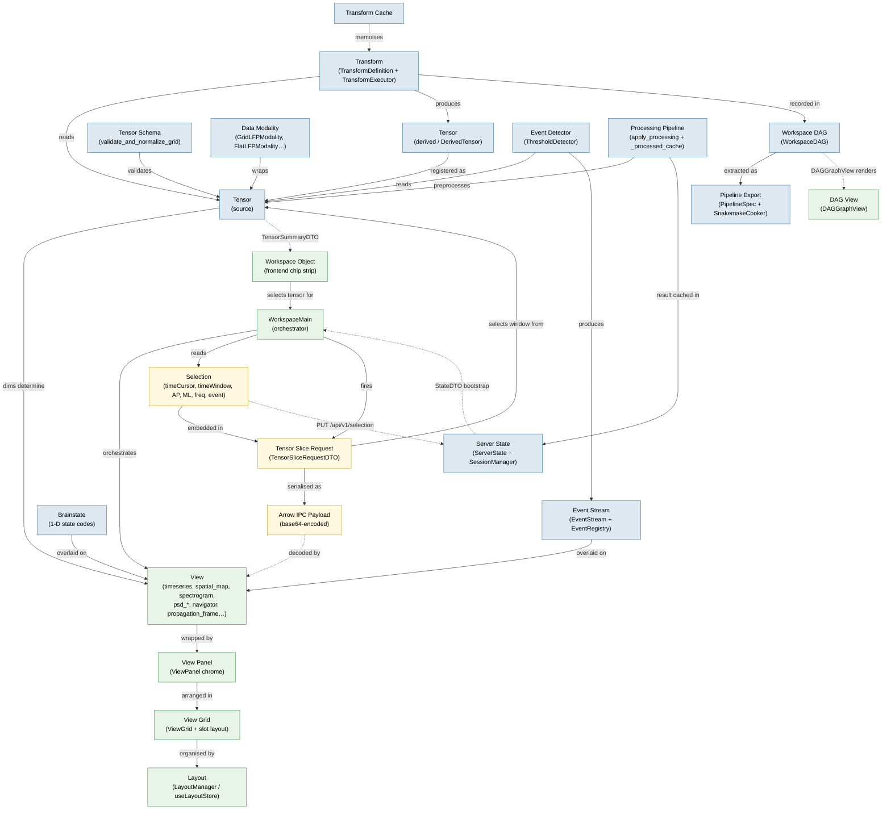

# TensorScope Architecture Diagram

A Mermaid entity diagram showing how TensorScope's core entities relate to
each other. All relationships are grounded in repository evidence; see
[relationships.md](relationships.md) for the textual relationship model and
[layers.md](layers.md) for the layered view.

---

## Conceptual Entity Diagram

Arrows are labelled with the type of relationship.
Dashed arrows (`-.->`) cross the HTTP boundary between backend and frontend.

**Colour key**
- Blue nodes — backend entities (`src/tensorscope/`)
- Green nodes — frontend entities (`frontend/src/`)
- Yellow nodes — boundary entities that exist in both or cross the HTTP wire

---

## Reading the Diagram

**Solid arrows** are intra-layer or same-side relationships:
- Data lineage: `Schema → Tensor → Transform → DerivedTensor`
- View pipeline: `View → ViewPanel → ViewGrid → Layout`
- Control: `Selection → SliceRequest → View data`

**Dashed arrows** cross the HTTP boundary or represent asynchronous
bootstrapping:
- `ServerState -.-> WorkspaceMain` — `GET /api/v1/state` returns `StateDTO`
  which bootstraps the frontend stores on load
- `Selection -.-> ServerState` — `PUT /api/v1/selection` persists the
  cursor to the server; React Query invalidation then refetches all slice queries
- `SourceTensor -.-> WorkspaceObject` — `TensorSummaryDTO` fields are mapped
  to frontend chip-strip objects in `WorkspaceMain`

**Node groupings** by layer (see [layers.md](layers.md)):
- Blue (backend): Analysis Layer entities — Tensor, Transform, ProcessingPipeline, DAG, Events, Brainstate
- Green (frontend): Visualization + UI Shell entities — View, ViewPanel, Layout, WorkspaceMain
- Yellow (boundary): State + Transport entities that exist on both sides or traverse the wire
